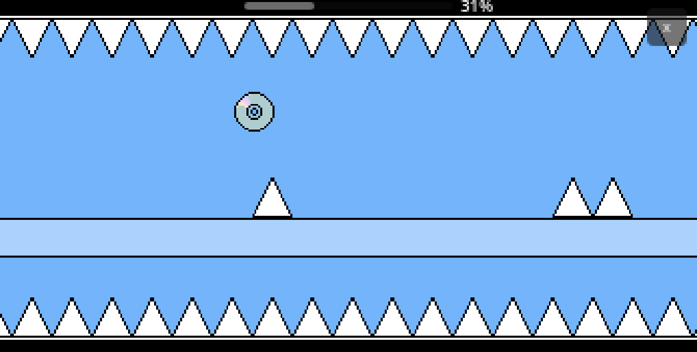
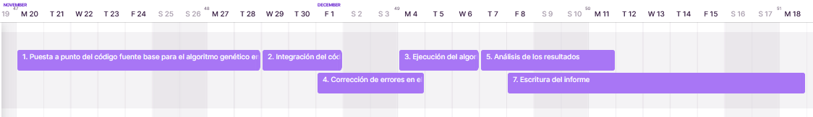

# Algoritmo Genético que aprende a jugar un videojuego

## Código Proyecto: GACD

### Lucas Moyano

## 1. Descripción

La idea de este proyecto es **programar un algoritmo genético para el juego que estoy desarrollando llamado CDcrash** implementado usando el mismo código fuente en Godot usando GDscript, observar hasta que porcentaje del nivel llega y compararlo con un algoritmo aleatorio.

**CDcrash es un videojuego 2D platformer/side-scroller** en donde el jugador representado por un CD se mueve constantemente hacia la derecha hasta llegar al final del nivel o morir por no haber esquivado un obstáculo, para esquivar estos obstáculos el jugador tiene dos movimientos, uno es el típico salto de todo platformer y el otro es un teletransporte que además cambia la gravedad. El progreso del jugador en el nivel es representado por una barra y un porcentaje en la parte superior de la pantalla.

## 2. Objetivos:

El algoritmo genético tiene que:

- Llegar al 100% (nivel completado) o a un buen porcentaje (mayor que 80%-70%)
- Coleccionar el mayor numero de monedas (máximo 3)
- Minimizar el numero de intentos

## 3. Alcance:

El alcance del proyecto se limitará al nivel 1 de CDcrash. Las variables y complejidades de niveles posteriores no estarán contempladas en esta fase inicial.

## 4. Limitaciones:

- El tiempo de ejecución, el algoritmo genético podría tardarse mucho en llegar a completar el nivel ya que al principio todas las acciones son elegidas al azar.
- No tenemos otro algoritmo, ya implementado, para comparar cual se tarda menos en encontrar una solución
	
## 5. Métricas:

- Numero de monedas coleccionadas
- Numero de intentos/generaciones que se tarda el algoritmo en llegar al 100%

## 6. Propuesta algoritmo genético:

Para lograr esto la idea es ejecutar el juego y que de manera random 10 (o más) players en contemporáneo vayan saltando, teletrasportándose o no hagan nada hasta llegar al final.

### 6.1 Representación

Mientras el juego se está ejecutando se creará una lista para cada player, que va a guardar la acción que se ha realizado (0 si no se hace nada, 1 si salta, 2 si se teletransporta) en la posición que representa el segundo en que se hizo (Por ejemplo si se teletransportó cuando el timer dice 0:40:34 se va a guardar en la posición [403] un 2, descartamos el ultimo numero porque tanta precision no nos sirve).  
Después de esto vamos a aplicar el algoritmo genético que según la función de fitness **(6.2)** va a elegir pares de miembros de la población y los va a reproducir usando cruzamiento, mutación y elitismo **(6.3)**.

### 6.2 Función fitness del algoritmo

La función fitness va a ser el porcentaje alcanzado por el player

### 6.3 Operadores

Como operadores vamos a implementar:

- *elitismo*: guardamos los 2 primeros individuos como están y los pasamos a la proxima generación, para no perder buenas soluciones.
- *cruzamiento*: tomando dos listas, elegimos un punto al azar dividiéndolas y tomamos la primera parte de una lista y la segunda de otra creando así el hijo, esto da buenos resultados en general.
- *mutación*: tenemos una cierta probabilidad de modificar 1 o más acciones de la lista del hijo, esto lo hacemos para que haya diversidad y no se quede solo con las acciones generadas al principio.

## 7. Justificación

Como es un juego en tiempo real el entorno va cambiando cada segundo, haciendo que se haga difícil programarlo de manera tradicional, con inteligencia artificial podemos llegar a un algoritmo que se adapte a cualquier situación en tiempo real.Esto se asemeja mucho a como solucionamos problemas nosotros, por eso esto es importante y aunque ahora lo estemos usando para completar un juego esto se podría utilizar en cosas más complejas, útiles y avanzadas.

## 8. Listado de actividades a realizar

1. *Puesta a punto del código fuente base para el algoritmo genético en GDscript* [7 días]
2. *Integración del código con la parte visual del juego* [3 días]
3. *Ejecución del algoritmo y ajuste de los parámetros del algoritmo genético* [3 días]
4. *Corrección de errores en el código* [2 días]
5. *Análisis de los resultados* [2 días]
6. *Escritura del informe*  [7 días]

## 9. Cronograma estimado de actividades

## 10. Bibliografía

[Stuart J. Russell and Peter Norvig, Artificial Intelligence A Modern Approach, Third Edition]() - [Información sobre el algoritmo genético y como implementarlo]

[Ambuehl, Nathan, "Investigating Genetic Algorithm Optimization Techniques in Video Games" (2017). Undergraduate Honors Theses. Paper 748. https://dc.etsu.edu/honors/748](https://dc.etsu.edu/honors/748/) - [Uso de algoritmos genéticos para resolver Super Mario Bros]

[AI Learns to play JUMP KING](https://youtu.be/DmQ4Dqxs0HI?si=SM80CKFyj_3gc2YN&t=66) - [Inspiración para la idea de usar algoritmos genéticos que resuelvan videojuegos]
