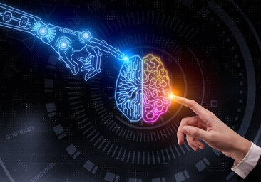

# Actividad 1

*Lucas Moyano*

## 1. Buscar 2 ejemplos de aplicaciones de inteligencia artificial.

## 2. ¿Qué se entiende por inteligencia artificial ?

La inteligencia artificial (IA) es una rama de la informática y la ciencia de la computación que se enfoca en crear sistemas y programas que puedan realizar tareas que, en apariencia, requieren de inteligencia humana. Estos sistemas buscan emular la capacidad de aprendizaje, razonamiento, percepción y toma de decisiones que normalmente asociamos con la inteligencia humana.

El objetivo de la inteligencia artificial es desarrollar algoritmos y modelos que permitan a las máquinas procesar datos, aprender de ellos y mejorar su rendimiento con el tiempo, sin intervención humana directa en cada paso del proceso. Para lograrlo, los sistemas de inteligencia artificial utilizan diversas técnicas y enfoques, como el aprendizaje automático (machine learning), el procesamiento del lenguaje natural (NLP), la visión por computadora, la planificación y la optimización, entre otros.

La inteligencia artificial se aplica en una amplia gama de sectores y campos, como la medicina, la robótica, la industria, los servicios financieros, la atención al cliente, los sistemas de recomendación, los asistentes virtuales, los vehículos autónomos y muchos otros. A medida que la tecnología avanza, la inteligencia artificial continúa desempeñando un papel crucial en la transformación de la sociedad y la forma en que interactuamos con la tecnología y el mundo que nos rodea.

## 3. ¿Qué se entiende por Inteligencia ?

La inteligencia es una capacidad mental general que nos permite comprender, aprender, razonar, resolver problemas, adaptarnos al entorno y tomar decisiones adecuadas para enfrentar distintas situaciones. Es un concepto complejo y multifacético que ha sido objeto de estudio y debate en la psicología y otras disciplinas.

Históricamente, la inteligencia se ha medido mediante pruebas de cociente intelectual (CI), que intentan evaluar la capacidad cognitiva de una persona en comparación con otras de su grupo de edad. Sin embargo, la definición y medición de la inteligencia han evolucionado con el tiempo para abarcar aspectos más amplios y variados de la capacidad mental.

En la actualidad, hay diferentes teorías sobre la inteligencia. Una de las más influyentes es la teoría de las inteligencias múltiples propuesta por Howard Gardner, que sugiere que la inteligencia no es una entidad única, sino que se compone de diversas formas de inteligencia, como la lingüística, la lógico-matemática, la espacial, la musical, la corporal-kinestésica, la interpersonal, la intrapersonal y la naturalista, entre otras.

Además, la inteligencia no se limita al ámbito humano, ya que también podemos encontrar diferentes formas de inteligencia en otros seres vivos, como animales y plantas, adaptadas a sus respectivos entornos.

En resumen, la inteligencia es una capacidad mental compleja que nos permite interactuar con el mundo, aprender de nuestras experiencias y adaptarnos a diferentes situaciones de manera efectiva. Es un concepto amplio que abarca diversos aspectos y puede manifestarse de diferentes maneras en diferentes individuos y especies.

## 4. ¿Qué se entiende por artificial ?

El término "artificial" se refiere a algo que ha sido creado, producido o generado por el ser humano, en contraste con lo que es natural o que existe de manera espontánea en la naturaleza. Lo artificial se opone a lo orgánico, biológico o generado de forma natural.

En el contexto de la inteligencia artificial (IA), la palabra "artificial" indica que se trata de la creación de sistemas, máquinas o programas diseñados para imitar o simular aspectos de la inteligencia humana. Estos sistemas artificiales pueden abordar tareas cognitivas, resolver problemas, tomar decisiones y aprender de los datos y experiencias, utilizando algoritmos y técnicas desarrolladas por los humanos.

La inteligencia artificial busca replicar características de la inteligencia humana, como el aprendizaje, la adaptabilidad y el razonamiento, mediante el uso de computadoras y algoritmos avanzados. Aunque se llame "inteligencia artificial", es importante destacar que la IA no posee una conciencia o una inteligencia similar a la humana; simplemente, es una simulación de ciertas capacidades inteligentes.

En resumen, lo artificial en el contexto de la inteligencia artificial se refiere a la creación deliberada de sistemas y programas que imitan aspectos de la inteligencia humana para realizar tareas específicas y resolver problemas en áreas diversas de la tecnología y la sociedad.

### Fuentes

[chatGPT](https://chat.openai.com/)