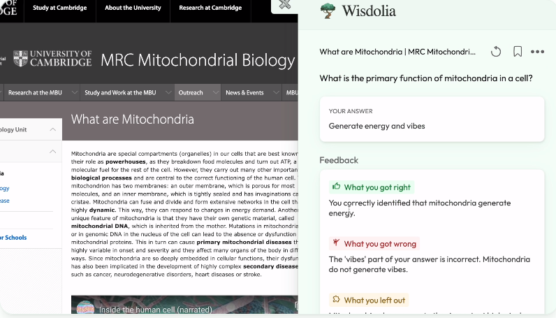
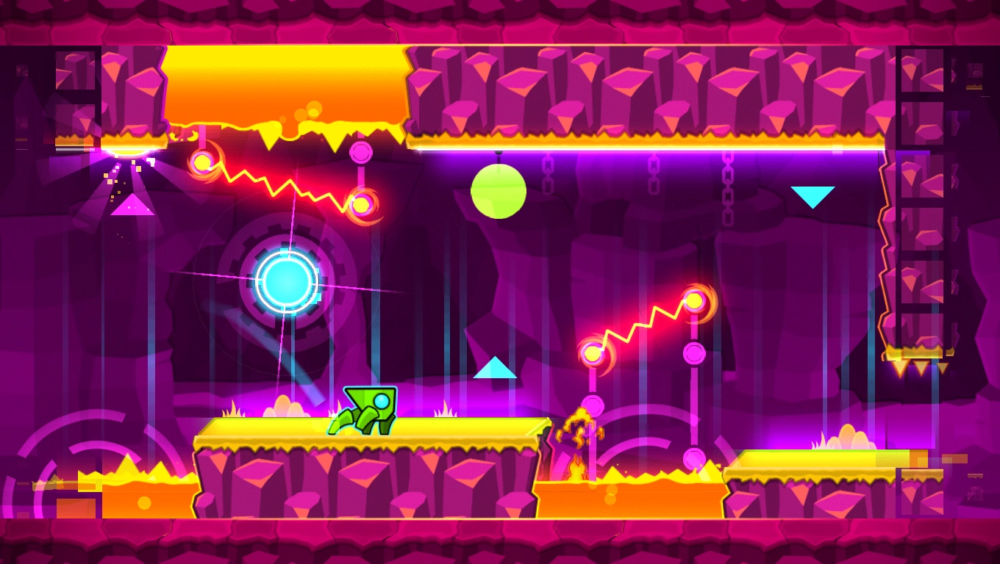
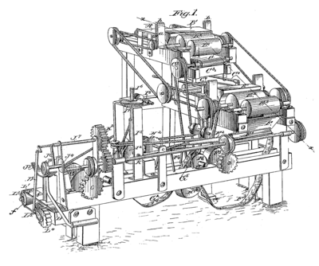

# Actividad 1

*Lucas Moyano*

## 1. Buscar 2 ejemplos de aplicaciones de inteligencia artificial.

### Wisdolia

Wisdolia es una **extensión gratis de Google Chrome que usa inteligencia artificial para generar cartas de preguntas que hacen justamente preguntas sobre el contenido de la pagina en donde se encuentra el navegador**, funciona con sitios web, pdfs y hasta con videos de YouTube.

Cuando respondes la pregunta se te van a dar posiblemente 3 tipos de feedback:

- What you got right: que es lo que respondiste bien
- What you got wrong: que es lo que respondiste mal
- What you left out: que es lo que te faltó en tu respuesta

Y además también se puede generar lo que la inteligencia artificial respondería a esa pregunta.

Aunque sea gratis tiene una versión premium sin limitaciones.

Esta extensión es muy interesante por el contraste que hace con la resistencia que algunos profesores tienen contra la inteligencia artificial cuando claramente se puede también usar para aprender.

### Mixo

**Mixo es un sitio web que genera otro sitio web, utilizando inteligencia artificial, para alguna idea de empresa que tengas y también un potencial nombre para ella, todo esto solo proporcionando una descripción.**

Puede ser muy util para tener una maqueta y hacerse una idea rápida de como podría verse el sitio de tu empresa o usarlo como base para programar el sitio que quieres.

La función básica es gratis pero para otras hay que pagar.

Además proporciona hosting para el sitio, un editor visual, diseño responsivo y optimizado con palabras claves.

### Extra: "Recreador" de videos en Geometry Dash

Propongo esta aplicación de inteligencia artificial porque me pareció interesante y creativa cuando la vi,además me parece bastante impresionante que haya sido desarrollada antes del boom de inteligencias artificiales de este año, aunque estoy al tanto que los algoritmos usados ya estaban presentes pero la idea no era tan popular como ahora.

Para entender de que se trata esta aplicación de inteligencia artificial se necesita un poco de contexto sobre el juego en cuestión, *Geometry Dash* es un videojuego platformer que se basa en un cubo (o otros diferentes iconos) que se mueve constamente a la derecha hasta llegar al final del nivel saltando los obstaculos con el único input que el jugador puede hacer que es saltar. Este juego presenta un editor de niveles que los jugadores pueden usar para hacer sus propios desafíos y publicarlos para que otras personas puedan jugarlos.

Así es como se ve un nivel del juego:

Ahora vamos a la parte de inteligencia artificial, Spu7nix, un miembro de la comunidad del videojuego desarrolló un **algoritmo evolutivo para recrear videos adentro del editor de juego usando los pocos objetos que proporciona este editor y los limites que tiene.** Subrayo que no es posible dibujar libremente en el editor si no que te proporciona diferentes bloques que puedes posicionar.

Así es como se ve una imagen recreada por el algoritmo de inteligencia artificial creado por Spu7Nix (para ver un video creado por este algoritmo ir al link de más abajo):

*imagen recreada a la izquierda y imagen original a la derecha*

Recomiendo mirar el video de Spu7Nix sobre el tema porque explica como funciona claramente y los desafios que tuvo que superar para que esto sea posible.

[Generating Videos in Geometry Dash with Evolution](https://www.youtube.com/watch?v=6aXx6RA1IK4)

Últimamente no es algo que va a cambiar el mundo pero es interesante ver como algo tan limitado como un editor de niveles de un videojuego pueda copiar y transmitir un video bastante fielmente a través de inteligencia artificial.

También es interesante como el creador decidió dejar el codigo privado para que no se llenen los servidores de niveles por el estilo que no aportan nada, lo que da una pequeña ventana a que la inteligencia artificial casi siempre tiene **implicaciones eticas** por tan pequeñas que pueden ser.

## 2. ¿Qué se entiende por inteligencia artificial ?

La *inteligencia artificial* (IA) **es una rama de la informática y la ciencia de la computación que se enfoca en crear sistemas y programas que puedan realizar tareas que, en apariencia, requieren de inteligencia humana.** Estos sistemas buscan emular la capacidad de aprendizaje, razonamiento, percepción y toma de decisiones que normalmente asociamos con la inteligencia humana.

**El objetivo de la inteligencia artificial es desarrollar algoritmos y modelos que permitan a las máquinas procesar datos, aprender de ellos y mejorar su rendimiento con el tiempo, sin intervención humana directa en cada paso del proceso.** Para lograrlo, los sistemas de inteligencia artificial utilizan diversas técnicas y enfoques, como el aprendizaje automático (machine learning), el procesamiento del lenguaje natural (NLP), la visión por computadora (computer vision), la planificación y la optimización, entre otros.

La inteligencia artificial se aplica en una amplia gama de sectores y campos, como la medicina, la robótica, la industria, los servicios financieros, la atención al cliente, los sistemas de recomendación, los asistentes virtuales, los vehículos autónomos y muchos otros. A medida que la tecnología avanza, la inteligencia artificial continúa desempeñando un papel crucial en la transformación de la sociedad y la forma en que interactuamos con la tecnología y el mundo que nos rodea.

**La inteligencia artificial se puede dividir en 4 categorías basadas en el tipo y complejidad de la tarea que un sistema puede realizar**:
- **Reactive Machines**: (Maquinas reactivas) son capaces de percibir y reaccionar al mundo a su frente mientras realiza tareas limitadas;
- **Limited Memory**: (Memoria limitada) son capaces de guardar datos del pasado y predicciones para hacer predicciones de lo que va a venir;
- **Theory of mind**: (Teoría de la mente) son capaces de tomar decisiones basados en sus percepciones de como los otros se sienten y tomar decisiones;
- **Self-Awareness**: (Consciente de si mismo) son capaces de operar con una consciencia a nivel humano y pueden entender su propria existencia.

Hasta el dia de hoy no hemos llegado al nivel de Theory of mind o de Self-Awareness.

Además es un concepto muy utilizado en la ciencia ficción, justamente por esto la gente tienen un concepto algo distorsionado o exagerado de lo que puede ser una inteligencia artificial, lo que provocó temor en el boom de la inteligencia artificial que hubo este año.

Aunque se llame "inteligencia artificial", es importante destacar que **la IA no posee una conciencia o una inteligencia similar a la humana**, simplemente es una simulación de ciertas capacidades inteligentes.

## 3. ¿Qué se entiende por Inteligencia ?

**La inteligencia es una capacidad mental general que nos permite comprender, aprender, razonar, resolver problemas, adaptarnos al entorno y tomar decisiones adecuadas para enfrentar distintas situaciones.** Es un concepto complejo y multifacético que ha sido objeto de estudio y debate en la psicología y otras disciplinas.

Históricamente, la inteligencia se ha medido mediante pruebas de cociente intelectual (CI), que intentan evaluar la capacidad cognitiva de una persona en comparación con otras de su grupo de edad. Sin embargo, la definición y medición de la inteligencia han evolucionado con el tiempo para abarcar aspectos más amplios y variados de la capacidad mental.

En la actualidad, hay diferentes teorías sobre la inteligencia. Una de las más influyentes es la teoría de las inteligencias múltiples propuesta por Howard Gardner, que sugiere que la inteligencia no es una entidad única, sino que se compone de diversas formas de inteligencia, como la lingüística, la lógico-matemática, la espacial, la musical, la corporal-kinestésica, la interpersonal, la intrapersonal y la naturalista, entre otras.

Además, **la inteligencia no se limita al ámbito humano**, ya que también podemos encontrar diferentes formas de inteligencia en otros seres vivos, como animales y plantas, adaptadas a sus respectivos entornos.

En resumen, la inteligencia es una capacidad mental compleja que nos permite interactuar con el mundo, aprender de nuestras experiencias y adaptarnos a diferentes situaciones de manera efectiva. Es un concepto amplio que abarca diversos aspectos y puede manifestarse de diferentes maneras en diferentes individuos y especies.

## 4. ¿Qué se entiende por artificial ?

El término *"artificial"* **se refiere a algo que ha sido creado, producido o generado por el ser humano**, en contraste con lo que es natural o que existe de manera espontánea en la naturaleza. Lo artificial se opone a lo orgánico, biológico o generado de forma natural.

En el contexto de la inteligencia artificial (IA), la palabra "artificial" indica que se trata de la creación de sistemas, máquinas o programas diseñados para imitar o simular aspectos de la inteligencia humana.

### Fuentes

- [chatGPT](https://chat.openai.com/)
- [https://github.com/LucasEPK/ia-uncuyo-2022/blob/main/tp1-fundamentos/ia1-activitidad1.md](https://github.com/LucasEPK/ia-uncuyo-2022/blob/main/tp1-fundamentos/ia1-activitidad1.md)
- [https://www.youtube.com/watch?v=gpP_YEv_9jA](https://www.youtube.com/watch?v=gpP_YEv_9jA)
- [https://www.wisdolia.com/](https://www.wisdolia.com/)
- [https://app.mixo.io/ai-website-builder](https://app.mixo.io/ai-website-builder)
- [https://www.youtube.com/watch?v=6aXx6RA1IK4](https://www.youtube.com/watch?v=6aXx6RA1IK4)