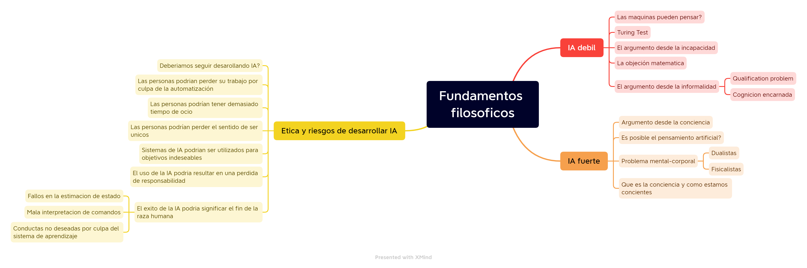

# Trabajo Practico Nº1

*Lucas Moyano*

# Indice

- [Ejercicio 1](#ejercicio-1)
    - [Inteligencia artificial débil](#inteligencia-artificial-débil)
    - [Inteligencia artificial fuerte](#inteligencia-artificial-fuerte)
    - [La ética y los riesgos de desarrollar inteligencia artificial](#la-ética-y-los-riesgos-de-desarrollar-inteligencia-artificial)
    - [Conclusión y opinion personal](#conclusion-y-opinion-personal)
- [Ejercicio 2](#ejercicio-2)
- [Fuentes](#fuentes)

# Ejercicio 1

La afirmación que las maquinas podrían actuar *como si fueran inteligentes* es llamada por los filósofos la hipótesis de **IA débil**, y la afirmación que las maquinas que hacen eso estén *realmente pensando* (No solo simulando el pensamiento) es llamada la hipótesis de **IA fuerte**.

## Inteligencia artificial débil

Surge la pregunta de que si las maquinas pueden actuar de manera inteligente. Esto dependería de la definición de inteligencia artificial, pero los filósofos están interesados en el problema de comparar dos arquitecturas *humana y maquina*. Además, ellos tradicionalmente formaron la pregunta no en términos de maximizar la utilidad esperada sino como "**Las maquinas pueden pensar?**".

**Alan Turing**, en su famoso paper "Computing Machinery and Intelligence"(1950) sugiere la idea que en vez de preguntarnos si las maquinas pueden pensar, deberíamos preguntar si las maquinas pueden pasar un test de inteligencia conductual, el cual ha sido llamado **Turing Test**. El test es que un programa tenga una conversación (a través de mensajes escritos) con un interrogador por 5 minutos. El interrogador después tiene que adivinar si la conversación fue con un programa o una persona, el programa pasa el test si engaña el interrogador 30% de las veces. Los programas todavía no logran hacer esto con un juez sofisticado. Aunque muchas personas han sido engañadas cuando no se les dice que podrían haber estado hablando con una computadora.

Turing también examinó una gran variedad de posibles objeciones a la posibilidad de maquinas inteligentes, veremos algunas:

- **El argumento desde la incapacidad**

    El "argumento desde la incapacidad" dice que "*Una maquina nunca puede hacer X*". Como ejemplos de X, Turing menciona los siguientes:

    Ser buena, ingeniosa, hermosa, amigable, tener iniciativa, tener un sentido del humor, distinguir el bueno del malo, cometer errores, enamorarse, hacer que alguien se enamore de ella y muchos más

    Algunas de estas características son fáciles de conseguir pero otras como tener un sentido del humor o enamorarse ya parecen mucho más complicadas. (Update 2023: las IA pueden simular un sentido del humor y también enamorarse, pero solo copian lo que han sido entrenadas en hacer)

    Teniendo lo que sabemos sobre computadoras, no es sorprendente que sean buenas en los problemas combinatorios como jugar ajedrez. Pero los algoritmos también realizan a nivel humano tareas que parecen involucrar el juicio humano, o como dijo Turing "aprender de las experiencias" y la habilidad de "distinguir lo bueno del malo"

    Es claro que las computadoras pueden hacer muchas cosas como o mejor que los humanos, incluyendo cosas que las personas creen que requieren una buena intuición y comprensión humana. Esto no significa que no existan cosas que las computadoras no hayan dominado todavía, por ejemplo el Turing Test.

- **La objeción matemática**

    Es bien sabido que durante el trabajo de Turing y Godel,que ciertas preguntas matemáticas son en principio incontestables por particulares sistemas formales. **El teorema de Incompletitud de Godel** es el ejemplo más famoso de esto.

    Algunos filósofos han afirmado que este teorema demuestra que las maquinas son mentalmente inferiores que los humanos. Esta afirmación tiene 3 problemas: 

    La primera es que el teorema de Incompletitud de Godel se aplica solamente a sistemas formales que son lo suficientemente poderosos para hacer aritmética. Esto incluye las maquinas de Turing, la afirmación está en parte basada en la aserción que las computadoras son Maquinas de Turing. Esta es una buena aproximación pero no es totalmente verdad. Las maquinas de Turing son infinitas mientras que las computadoras son finitas.

    La segunda es que un agente no debería estar muy avergonzado que no pueda establecer la verdad de una frase cuando otros agentes pueden. En los humanos nos pasa a cada rato.

    La tercera y más importante, incluso si probamos que las computadoras tienen limites en lo que pueden probar, no hay evidencia que los humanos sean inmunes de esas limitaciones.

- **El argumento desde la informalidad**

    Una de las criticas más influyente y persistente de la IA como iniciativa fue puesta a la luz por Turing como el "*argumento desde la informalidad de la conducta*". Esencialmente, esta es la afirmación que la conducta humana es demasiado complicada para ser capturada por cualquier conjunto de reglas simples y ya que las computadoras solo pueden seguir un conjunto de reglas, no pueden generar una conducta tan inteligente como la de los humanos. La incapacidad de capturar todo en un conjunto de reglas lógicas es llamado el **"qualification problem"** en IA.

    El principal defensor de esta idea es el filosofo Hubert Dreyfus, esta critica se dirige más que nada a nuestra manera de programar computadoras. 

    Según Dreyfus, la habilidad humana incluye un conjunto de reglas, pero solo como segundo plano. El ejemplo que da en el contexto de jugar ajedrez es: "Un simple maestro de ajedrez podría necesitar averiguar que hay que hacer, pero un gran maestro solo ve el tablero demandando una cierta jugada... la respuesta correcta aparece en su cabeza". Ciertamente es verdadero que mucho del proceso mental de un gran maestro es hecho a a un nivel que no es abierto a la introspección de la mente consciente. Pero esto no significa que el proceso mental no exista. La pregunta importante que Dreyfus no responde es *como* una jugada buena llega a la cabeza del gran maestro.

    Muchos de los problemas en los cuales se ha enfocado Dreyfus, el sentido común, el "qualification problem", incertidumbre, aprendizaje, formas compiladas de tomas de decisiones, son en efecto problemas importantes y ya han sido incorporados en el estándar de diseño de agentes inteligentes.

    También hay que considerar que para entender como los agentes humanos funcionan, tenemos que considerar el agente completo, no solo su programa. Así se crea el concepto de **cognición encarnada** que dice que no tiene sentido considerar el cerebro de manera separada, la cognición tiene lugar en el cuerpo que se encuentra en un ambiente.

## Inteligencia Artificial fuerte

Muchos filósofos afirman que una maquina que pasa el test de Turing aún no estaría realmente pensando sino que seria una simulación de pensar. Turing llama a esto el **argumento desde la conciencia**, la maquina tiene que ser consciente de sus proprios estados mentales y acciones. Otros se enfocan en intencionalidad osea, la pregunta es si los deseos, creencias y otras representaciones son realmente sobre algo en la vida real.

La respuesta de Turing a este argumento fue que no es util conocer la respuesta a esta pregunta, ya que *tampoco tenemos evidencia directa de los estados mentales de otros humanos, pero asumimos que todos piensan*.

Esta respuesta nos sugiere que a medida de que las maquinas lleguen a un determinado nivel de sofisticación este argumento se andará disolviendo solo. Esto haría que se disuelva también la diferencia entre IA débil y fuerte. En contra de esto, uno podría insistir en que hay un problema factual: los humanos tenemos mentes de verdad y las maquinas podrían como no podrían tenerlas. Para saber la respuesta de esto deberíamos entender como los humanos tenemos mentes de verdad. Muchos filósofos han hecho esfuerzos para resolver este **problema mental-corporal**. Hay dos maneras de pensar este problema:
la primera es la **dualista** que dice que la actividad mental de pensar y los procesos físicos del cuerpo son dos cosas separadas, mientras que la segunda el **fisicalismo** dice que la mente no está separada del cuerpo, que los estados mentales son estados físicos.

Los filósofos fisicalistas han intentado explicar que significa que una persona, y por extension una computadora, está en un particular estado mental. Se han enfocado en particular en estados intencionales, como por ejemplo creer, saber, desear, tener miedo, etc...

Además surgen numerosos problemas del hecho que todavía no sabemos como estamos conscientes, y si no sabemos eso tampoco sabemos como crear a algo intencionalmente que sea consciente o si algo que ya creamos sea consciente. Turing admite que el problema de la conciencia es difícil, pero dice que no tiene mucha relevancia en la practica de la IA, ya que se está tratando de hacer programas que actúan inteligentemente, **que adicionalmente queramos hacerlos conscientes es otro problema aparte**.

## La ética y los riesgos de desarrollar inteligencia artificial

Hasta ahora hemos hecho los que nos gusta hacer a los humanos, osea concentrarnos en si *podríamos* desarrollar IA, pero también deberíamos considerar si *deberíamos*. Si los efectos de la tecnología de IA es mucho más probable que sean negativos a que sean positivos, entonces seria una responsabilidad moral de los trabajadores en el campo de redireccionar su investigación.

Todos los científicos e ingenieros tienen que considerar problemas éticos, pero la IA propone nuevos problemas:

- Las personas podrían perder su trabajo por culpa de la automatización

    La industria moderna de la economía ya se ha vuelto dependiente de las computadoras en general, pero hasta ahora, la automatización ha creado más trabajos de los que ha eliminado, y ha creado trabajos más interesantes y de más recaudo. Ahora que la IA se define como "Agente inteligente" diseñado para asistir al humano, la perdida del trabajo es un problema menor a lo que era cuando IA se enfocaba en sistemas expertos diseñados para remplazar a los humanos. Aunque algunos investigadores siguen pensando que hacer el trabajo completo sea el objetivo correcto para la IA.

- Las personas podrían tener demasiado tiempo de ocio

    Algunos pensaban que las personas modernas iban a estar en un futuro lleno de aburrimiento, donde "el problema mayor en su vida es el de elegir entre los miles de canales en la televisión". Esta es una visión muy anticuada y necia ya que sabiendo que los humanos cuando están aburridos es cuando más tienen ideas y hacen cosas.

    En vez, hoy en dia las personas trabajando en industrias intensas en el conocimiento se han encontrado en tener que estar al paso y trabajar más horas.

    Con la IA también podría darnos la oportunidad de tomarnos un tiempo libre mientra los agentes automáticos se encargan por un tiempo de nuestros asuntos.

- Las personas podrían perder el sentido de ser únicos

    En realidad la humanidad ya ha sobrevivido caídas en nuestro sentido de unicidad, como por ejemplo cuando se dejó de pensar que la tierra estaba en el centro del sistema solar.

    La IA, si tiene mucho éxito, seria tan peligrosa a las ideas morales de la sociedad del 21-esimo siglo como lo fue la teoría de la evolución de Darwin a las del 19-esimo siglo.

- Sistemas de IA podrían ser utilizados para objetivos indeseables

    Una ciencia se dice que es util cuando su desarrollo tiene la posibilidad de acentuar iniquidades existente o promueve la destrucción de la humanidad. Esto ciertamente vale para la IA, ya se han usado sistemas autónomos de IA para guerras. En el sentido extremo de la moral algunos dicen que esto es una version mejorada de ponerse un casco en la cabeza si sos un soldado. En otro sentido armas robóticas crean nuevos riesgos, por ejemplo una maquina podría decidir matar inocentes.

    Otro peligro de la IA es la perdida de privacidad, algunos las aceptan diciendo que ya no tenemos privacidad y otros piensan que deberíamos ser cuidadosos.

- El uso de la IA podría resultar en una perdida de responsabilidad

    Esto puede conectarse a lo antes descrito, si una maquina empieza a matar civiles por un fallo, quien toma la responsabilidad?
    Y si un vehículo que se maneja solo hace un accidente?

- El éxito de la IA podría significar el fin de la raza humana

    Casi todas las tecnologías tienen el potencial de causar daño en las manos equivocadas pero con la IA y robótica, tenemos el nuevo problema que *las manos equivocadas sean propiamente la de la tecnología en si misma*.

    La cuestión es si un sistema de IA tiene un mayor riesgo que software tradicional. Vamos a ver tres fuentes de riesgo:

    - El estado de estimación del sistema de IA podría ser incorrecto, causando hacer algo incorrecto. Por ejemplo un auto que se maneja solo detecta incorrectamente la posición de un auto y produce un accidente, o un sistema de defensa contra misiles detecta un misil erróneamente, lanzando un misil, y causa la muerte de millones de personas. Estos errores los pueden cometer también humanos o computadoras, osea no es un problema especifico, solo se necesitan medidas de seguridad para que esto no pase.

    - Especificar la justa utilidad de un sistema de IA para maximizarlo no es tan fácil. Por ejemplo podríamos pedirle que minimize el sufrimiento humano expresándolo como un sistema de recompensa adicional en el tiempo. Pero por como somos los humanos siempre encontramos una forma de sufrir aún cuando la estamos pasando bien. Entonces la maquina podría pensar que la solución optimal seria la de terminar con la raza humana lo más pronto posible, si no hay humanos no hay sufrimiento. Hay que ser cuidados con lo que se le pide.

    - La función de aprendizaje del sistema de IA podría causar que evolucione en un sistema con conductas no deseadas.

    Suponiendo que pueda existir una **maquina ultrainteligente** definida como una maquina que supera cualquier tipo de inteligencia humana, aún la de un genio. Esa maquina sería capaz de diseñar maquinas aún más inteligentes y esto generaría una **explosion de inteligencia**, entonces la maquina ultrainteligente sería el ultimo invento que un humano pueda hacer. La explosion de inteligencia también se llama **singularidad tecnológica**.
    El concepto de maquinas ultrainteligentes asume que la inteligencia sea un atributo esencialmente importante, y si tienes suficiente de ella, todos los problemas pueden resolverse. Pero sabemos que hay limites en la computabilidad y complejidad computacional.

    Si las maquinas ultrainteligentes son posibles, deberíamos asumir la responsabilidad de diseñarlas para que nos traten bien para evitar nuestra extinción.

    Funciones de amigabilidad deberían estar desde el principio, porque ya que una maquina puede aprender, pongamos como ejemplo que vea que un humano mata un insecto sin consecuencias morales porque los insectos no tienen un cerebro tan desarrollado como el nuestro, entonces la maquina podría concluir que para el, matar un humanos tampoco tenga ninguna aplicación moral porque tenemos un intelecto inferior al de ellos.

También existe la consideración que si los robots empiezan a estar conscientes entonces podría ser immoral tratarlos solo como maquinas.

### Conclusión y opinion personal

En mi opinion, como dijo Turing, la IA se va a ir desarrollando y de a poco se va a ir disolviendo el concepto de IA débil y fuerte. Creo que la IA nos va a ayudar a resolver uno de los misterios más grandes de la neurociencia: como funciona el cerebro en detalle. También pienso que se debería tener mucho cuidado con desarrollar esta tecnología porque tiene un potencial muy alto y los humanos no somos muy buenos a predecir los desastres que podrían pasar y actuar a tiempo, como demostrado por la pandemia generada por el COVID-19.

A todo esto me fascina el concepto de que si una computadora podría llegar a crear algo realmente original, como un cuadro o una película. Seria realmente original o es solo una copia de lo que nosotros humanos hemos inventado hasta ahora? A todo esto, nosotros humanos somos realmente originales? (Update 2023: estas preguntas son todavía más relevante de cuando las hice en 2022) La mayoría de las ideas vienen por inspiración de ideas que tuvieron nuestro antecedentes y una mezcla de nuestro ingenio e intuición. Ese ingenio e intuición pueden ser generados por un conjunto de reglas? Nosotros humanos de donde sacamos ese ingenio e intuición? También realizamos cálculos solamente que son inconscientes? Que tan diferentes seriamos de una maquina inteligente y consciente?

También el concepto de que una maquina se enamore es muy interesante.

Si el invento del internet y del celular ha cambiado tanto al mundo, no alcanzo ni a imaginar como serian nuestras vidas con IA super inteligentes.

# Ejercicio 2

Usos malintencionados de las nuevas tecnologías siempre hay, yo creo que lo que habría que discutir sería si los beneficios que pueden traer estas tecnologías son más de los problemas. Y poner leyes y regular todo lo relacionado con problemas morales.

Al fin y al cabo también el internet se puede utilizar para cosas muy malas pero se han puesto ciertas medidas para mitigar esto.

Yo creo que la inteligencia artificial nos va a ser muy util para simplificar y aumentar la velocidad en el que hacemos cosas, haciéndonos así avanzar con tecnología y como sociedad más rápidamente. Cosa que también el internet en su momento nos ayudó a hacer, conectándonos con todo el conocimiento de todas las culturas.

#### Fuentes

-  AIMA 3

- [https://nymag.com/intelligencer/article/ai-artificial-intelligence-chatbots-emily-m-bender.html](https://nymag.com/intelligencer/article/ai-artificial-intelligence-chatbots-emily-m-bender.html)