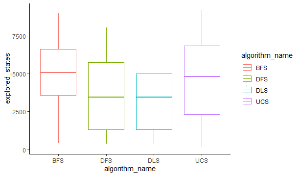

# TP3
## Lucas moyano

B) 

| | BFS | DFS | DLS | UCS |
|-|-|-|-|-|
|Media|5068.9|3675.43|3149.67|4567.37|
|Desviación|2505.05|2404.42|1700.77|2759.81|

C) El algoritmo más adecuado para resolver este problema es el BFS ya que es completo y optimo. Esto se debe a que BFS es optimal cuando todas las paths tienen el mismo costo, que es el caso de este problema.
