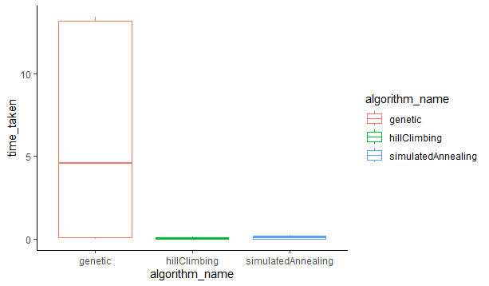
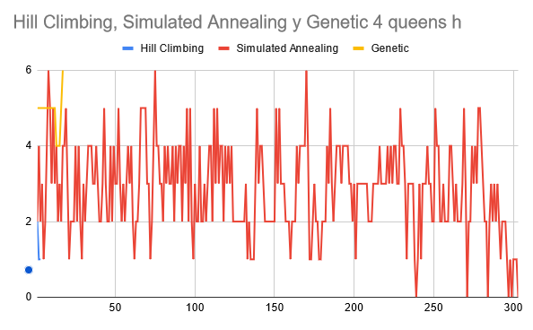

# TP5
## Lucas moyano

A)

### 4 reinas
| | hill climbing | simulated annealing | genetic |
|-|-|-|-|
|Porcentaje de soluciones|40|46.67|100|
|Media tiempo|0.0014|0.0184|0.0584|
|Desviación tiempo|0.0006|0.0018|0.0645|
|Media estados|2.7|399|92.67|
|Desviación estados|0.6513|0|96.0095|

### 8 reinas
| | hill climbing | simulated annealing | genetic |
|-|-|-|-|
|Porcentaje de soluciones|6.6667|3.3333|40|
|Media tiempo|0.0384|0.1166|3.5636|
|Desviación tiempo|0.0098|0.0053|1.6516|
|Media estados|4.4667|799|1213.8|
|Desviación estados|1.0417|0|562.1469|

### 10 reinas
| | hill climbing | simulated annealing | genetic |
|-|-|-|-|
|Porcentaje de soluciones|6.6667|0|0|
|Media tiempo|0.0384|0.1166|3.5636|
|Desviación tiempo|0.0245|0.0039|0.0859|
|Media estados|5.1333|999|2000|
|Desviación estados|1.3322|0|0|

B)

C) El algoritmo genetico es el que, para mi criterio y por como lo he implementado, tiene mejores resultados ya que es el que tiene más porcentaje de encontrar una solución, y seguramente ajustando los parametros se podrian obtener buenos resultados para el problema de las 10 reinas también y quizas mejorar su tiempo de ejecución.