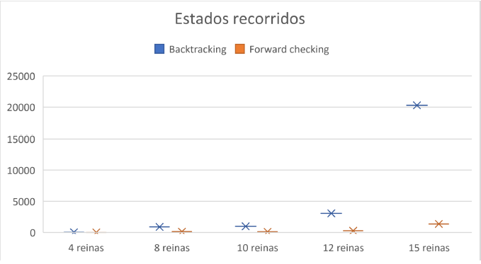
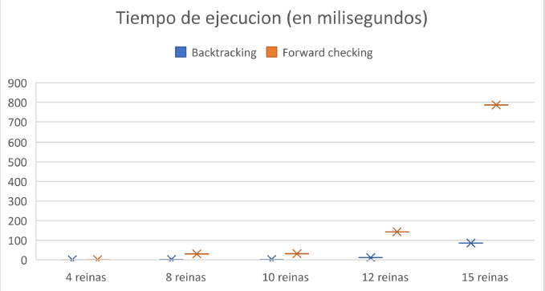

# TP6
## Lucas Moyano
## 1)
> Describir en detalle una formulación CSP para el Sudoku.

Nombramos a las variables desde A1 a A9 para la primera fila hasta I1 a I9 para la ultima.

Las casillas vacías tienen como dominio {1,2,3,4,5,6,7,8,9} y la casillas pre-llenadas tienen solo 1 numero como dominio.

Vamos a usar la restricción global Alldiff, existen 27 diferentes restricciones Alldiff, una por cada fila columna y caja de 9 cuadrados:

- Todas las filas tienen que tener diferentes números

Alldiff(A1, A2, A3, A4, A5, A6, A7, A8, A9)

Alldiff(B1, B2, B3, B4, B5, B6, B7, B8, B9)

Alldiff(C1, C2, C3, C4, C5, C6, C7, C8, C9)

Alldiff(D1, D2, D3, D4, D5, D6, D7, D8, D9)

Alldiff(E1, E2, E3, E4, E5, E6, E7, E8, E9)

Alldiff(F1, F2, F3, F4, F5, F6, F7, F8, F9)

Alldiff(G1, G2, G3, G4, G5, G6, G7, G8, G9)

Alldiff(H1, H2, H3, H4, H5, H6, H7, H8, H9)

Alldiff(I1, I2, I3, I4, I5, I6, I7, I8, I9)

- Todas las columnas tienen que tener diferentes números

Alldiff(A1, B1, C1, D1, E1, F1, G1, H1, I1)

Alldiff(A2, B2, C2, D2, E2, F2, G2, H2, I2)

Alldiff(A3, B3, C3, D3, E3, F3, G3, H3, I3)

Alldiff(A4, B4, C4, D4, E4, F4, G4, H4, I4)

Alldiff(A5, B5, C5, D5, E5, F5, G5, H5, I5)

Alldiff(A6, B6, C6, D6, E6, F6, G6, H6, I6)

Alldiff(A7, B7, C7, D7, E7, F7, G7, H7, I7)

Alldiff(A8, B8, C8, D8, E8, F8, G8, H8, I8)

Alldiff(A9, B9, C9, D9, E9, F9, G9, H9, I9)

- Todas las cajas tienen que tener diferentes números

Alldiff(A1, A2, A3, B1, B2, B3, C1, C2, C3)

Alldiff(A4, A5, A6, B4, B5, B6, C4, C5, C6)

Alldiff(A7, A8, A9, B7, B8, B9, C7, C8, C9)

Alldiff(D1, D2, D3, E1, E2, E3, F1, F2, F3)

Alldiff(D4, D5, D6, E4, E5, E6, F4, F5, F6)

Alldiff(D7, D8, D9, E7, E8, E9, F7, F8, F9)

Alldiff(G1, G2, G3, H1, H2, H3, I1, I2, I3)

Alldiff(G4, G5, G6, H4, H5, H6, I4, I5, I6)

Alldiff(G7, G8, G9, H7, H8, H9, I7, I8, I9)

## 2)
> Utilizar el algoritmo AC-3 para demostrar que la arco consistencia puede detectar la inconsistencia de la asignación parcial {WA=red, V=blue} para el problema del colorar el mapa de Australia (Figura 5.1 AIMA 2da edición ).

 - antes de ejecutar AC-3:
 
Queue: {(WA, NT);(NT, WA);(WA, SA);(SA, WA);(NT, SA);(SA,NT);(NT, Q);(Q, NT);(Q, SA);(SA, Q);(Q, NSW);(NSW, Q);(NSW, SA);(SA, NSW);(NSW, V);(V, NSW);(V, SA);(SA, V)}

D(WA) = {red}

D(V) = {blue}

D(NT) = {red,blue,green}

D(SA) = {red,blue,green}

D(Q) = {red,blue,green}

D(NSW) = {red,blue,green}

D(T) = {red,blue,green}

- loop 1 de AC-3:

Queue: {(NT, WA);(WA, SA);(SA, WA);(NT, SA);(SA,NT);(NT, Q);(Q, NT);(Q, SA);(SA, Q);(Q, NSW);(NSW, Q);(NSW, SA);(SA, NSW);(NSW, V);(V, NSW);(V, SA);(SA, V)} **removimos (WA, NT)**

D(WA) = {red}

D(V) = {blue}

D(NT) = {red,blue,green}

D(SA) = {red,blue,green}

D(Q) = {red,blue,green}

D(NSW) = {red,blue,green}

D(T) = {red,blue,green}

- loop 2 de AC-3:

Queue: {(WA, SA);(SA, WA);(NT, SA);(SA,NT);(NT, Q);(Q, NT);(Q, SA);(SA, Q);(Q, NSW);(NSW, Q);(NSW, SA);(SA, NSW);(NSW, V);(V, NSW);(V, SA);(SA, V)} **removimos (NT, WA)**

D(WA) = {red}

D(V) = {blue}

D(NT) = {blue,green} **removimos red**

D(SA) = {red,blue,green}

D(Q) = {red,blue,green}

D(NSW) = {red,blue,green}

D(T) = {red,blue,green}

- loop 3 de AC-3:

Queue: {(SA, WA);(NT, SA);(SA,NT);(NT, Q);(Q, NT);(Q, SA);(SA, Q);(Q, NSW);(NSW, Q);(NSW, SA);(SA, NSW);(NSW, V);(V, NSW);(V, SA);(SA, V)} **removimos (WA, SA)**

D(WA) = {red}

D(V) = {blue}

D(NT) = {blue,green}

D(SA) = {red,blue,green}

D(Q) = {red,blue,green}

D(NSW) = {red,blue,green}

D(T) = {red,blue,green}

- loop 4 de AC-3:

Queue: {(NT, SA);(SA,NT);(NT, Q);(Q, NT);(Q, SA);(SA, Q);(Q, NSW);(NSW, Q);(NSW, SA);(SA, NSW);(NSW, V);(V, NSW);(V, SA);(SA, V)} **removimos (SA, WA)**

D(WA) = {red}

D(V) = {blue}

D(NT) = {blue,green}

D(SA) = {blue,green} **removimos red**

D(Q) = {red,blue,green}

D(NSW) = {red,blue,green}

D(T) = {red,blue,green}

- loop 5 de AC-3:

Queue: {(SA,NT);(NT, Q);(Q, NT);(Q, SA);(SA, Q);(Q, NSW);(NSW, Q);(NSW, SA);(SA, NSW);(NSW, V);(V, NSW);(V, SA);(SA, V)} **removimos (NT, SA)**

D(WA) = {red}

D(V) = {blue}

D(NT) = {blue,green}

D(SA) = {blue,green}

D(Q) = {red,blue,green}

D(NSW) = {red,blue,green}

D(T) = {red,blue,green}

- loop 6 de AC-3:

Queue: {(NT, Q);(Q, NT);(Q, SA);(SA, Q);(Q, NSW);(NSW, Q);(NSW, SA);(SA, NSW);(NSW, V);(V, NSW);(V, SA);(SA, V)} **removimos (SA,NT)**

D(WA) = {red}

D(V) = {blue}

D(NT) = {blue,green}

D(SA) = {blue,green}

D(Q) = {red,blue,green}

D(NSW) = {red,blue,green}

D(T) = {red,blue,green}

- loop 7 de AC-3:

Queue: {(Q, NT);(Q, SA);(SA, Q);(Q, NSW);(NSW, Q);(NSW, SA);(SA, NSW);(NSW, V);(V, NSW);(V, SA);(SA, V)} **removimos (NT, Q);**

D(WA) = {red}

D(V) = {blue}

D(NT) = {blue,green}

D(SA) = {blue,green}

D(Q) = {red,blue,green}

D(NSW) = {red,blue,green}

D(T) = {red,blue,green}

- loop 8 de AC-3:

Queue: {(Q, SA);(SA, Q);(Q, NSW);(NSW, Q);(NSW, SA);(SA, NSW);(NSW, V);(V, NSW);(V, SA);(SA, V)} **removimos (Q, NT)**

D(WA) = {red}

D(V) = {blue}

D(NT) = {blue,green}

D(SA) = {blue,green}

D(Q) = {red,blue,green}

D(NSW) = {red,blue,green}

D(T) = {red,blue,green}

- loop 9 de AC-3:

Queue: {(SA, Q);(Q, NSW);(NSW, Q);(NSW, SA);(SA, NSW);(NSW, V);(V, NSW);(V, SA);(SA, V)} **removimos (Q, SA)**

D(WA) = {red}

D(V) = {blue}

D(NT) = {blue,green}

D(SA) = {blue,green}

D(Q) = {red,blue,green}

D(NSW) = {red,blue,green}

D(T) = {red,blue,green}

- loop 10 de AC-3:

Queue: {(Q, NSW);(NSW, Q);(NSW, SA);(SA, NSW);(NSW, V);(V, NSW);(V, SA);(SA, V)} **removimos (SA, Q)**

D(WA) = {red}

D(V) = {blue}

D(NT) = {blue,green}

D(SA) = {blue,green}

D(Q) = {red,blue,green}

D(NSW) = {red,blue,green}

D(T) = {red,blue,green}

- loop 11 de AC-3:

Queue: {(NSW, Q);(NSW, SA);(SA, NSW);(NSW, V);(V, NSW);(V, SA);(SA, V)} **removimos (Q, NSW)**

D(WA) = {red}

D(V) = {blue}

D(NT) = {blue,green}

D(SA) = {blue,green}

D(Q) = {red,blue,green}

D(NSW) = {red,blue,green}

D(T) = {red,blue,green}

- loop 12 de AC-3:

Queue: {(NSW, SA);(SA, NSW);(NSW, V);(V, NSW);(V, SA);(SA, V)} **removimos (NSW, Q)**

D(WA) = {red}

D(V) = {blue}

D(NT) = {blue,green}

D(SA) = {blue,green}

D(Q) = {red,blue,green}

D(NSW) = {red,blue,green}

D(T) = {red,blue,green}

- loop 13 de AC-3:

Queue: {(SA, NSW);(NSW, V);(V, NSW);(V, SA);(SA, V)} **removimos (NSW, SA)**

D(WA) = {red}

D(V) = {blue}

D(NT) = {blue,green}

D(SA) = {blue,green}

D(Q) = {red,blue,green}

D(NSW) = {red,blue,green}

D(T) = {red,blue,green}

- loop 14 de AC-3:

Queue: {(NSW, V);(V, NSW);(V, SA);(SA, V)} **removimos (SA, NSW)**

D(WA) = {red}

D(V) = {blue}

D(NT) = {blue,green}

D(SA) = {blue,green}

D(Q) = {red,blue,green}

D(NSW) = {red,blue,green}

D(T) = {red,blue,green}

- loop 15 de AC-3:

Queue: {(Q, NSW);(SA, NSW);(V, NSW);(V, SA);(SA, V)} **removimos (NSW, V), agregamos (Q, NSW);(SA, NSW)**

D(WA) = {red}

D(V) = {blue}

D(NT) = {blue,green}

D(SA) = {blue,green}

D(Q) = {red,blue,green}

D(NSW) = {red,green} **removimos blue**

D(T) = {red,blue,green}

- loop 16 de AC-3:

Queue: {(SA, NSW);(V, NSW);(V, SA);(SA, V)} **removimos (Q, NSW)**

D(WA) = {red}

D(V) = {blue}

D(NT) = {blue,green}

D(SA) = {blue,green}

D(Q) = {red,blue,green}

D(NSW) = {red,green}

D(T) = {red,blue,green}

- loop 17 de AC-3:

Queue: {(V, NSW);(V, SA);(SA, V)} **removimos (SA, NSW)**

D(WA) = {red}

D(V) = {blue}

D(NT) = {blue,green}

D(SA) = {blue,green}

D(Q) = {red,blue,green}

D(NSW) = {red,green}

D(T) = {red,blue,green}

- loop 18 de AC-3:

Queue: {(V, SA);(SA, V)} **removimos (V, NSW)**

D(WA) = {red}

D(V) = {blue}

D(NT) = {blue,green}

D(SA) = {blue,green}

D(Q) = {red,blue,green}

D(NSW) = {red,green}

D(T) = {red,blue,green}

- loop 19 de AC-3:

Queue: {(SA, V)} **removimos (V, SA)**

D(WA) = {red}

D(V) = {blue}

D(NT) = {blue,green}

D(SA) = {blue,green}

D(Q) = {red,blue,green}

D(NSW) = {red,green}

D(T) = {red,blue,green}

- loop 20 de AC-3:

Queue: {(WA, SA);(NT, SA);(Q, SA);(NSW, SA)} **removimos (SA, V), agregamos (WA, SA);(NT, SA);(Q, SA);(NSW, SA)**

D(WA) = {red}

D(V) = {blue}

D(NT) = {blue,green}

D(SA) = {green} **removimos blue**

D(Q) = {red,blue,green}

D(NSW) = {red,green}

D(T) = {red,blue,green}

- loop 21 de AC-3:

Queue: {(NT, SA);(Q, SA);(NSW, SA)} **removimos (WA, SA)**

D(WA) = {red}

D(V) = {blue}

D(NT) = {blue,green}

D(SA) = {green}

D(Q) = {red,blue,green}

D(NSW) = {red,green}

D(T) = {red,blue,green}

- loop 22 de AC-3:

Queue: {(WA, NT);(Q, NT);(Q, SA);(NSW, SA)} **removimos (NT, SA), agregamos (WA, NT);(Q, NT)**

D(WA) = {red}

D(V) = {blue}

D(NT) = {blue} **removimos green**

D(SA) = {green}

D(Q) = {red,blue,green}

D(NSW) = {red,green}

D(T) = {red,blue,green}

- loop 23 de AC-3:

Queue: {(Q, NT);(Q, SA);(NSW, SA)} **removimos (WA, NT)**

D(WA) = {red}

D(V) = {blue}

D(NT) = {blue}

D(SA) = {green}

D(Q) = {red,blue,green}

D(NSW) = {red,green}

D(T) = {red,blue,green}

- loop 24 de AC-3:

Queue: {(SA, Q);(NSW, Q);(Q, SA);(NSW, SA)} **removimos (Q, NT), agregamos (SA, Q); (NSW, Q)**

D(WA) = {red}

D(V) = {blue}

D(NT) = {blue}

D(SA) = {green}

D(Q) = {red,green} **removimos blue**

D(NSW) = {red,green}

D(T) = {red,blue,green}

- loop 25 de AC-3:

Queue: {(NSW, Q);(Q, SA);(NSW, SA)} **removimos (SA, Q)**

D(WA) = {red}

D(V) = {blue}

D(NT) = {blue}

D(SA) = {green}

D(Q) = {red,green}

D(NSW) = {red,green}

D(T) = {red,blue,green}

- loop 26 de AC-3:

Queue: {(Q, SA);(NSW, SA)} **removimos (NSW, Q)**

D(WA) = {red}

D(V) = {blue}

D(NT) = {blue}

D(SA) = {green}

D(Q) = {red,green}

D(NSW) = {red,green}

D(T) = {red,blue,green}

- loop 27 de AC-3:

Queue: {(NT, Q);(NSW,Q);(NSW, SA)} **removimos (Q, SA), agregamos (NT, Q);(NSW,Q)**

D(WA) = {red}

D(V) = {blue}

D(NT) = {blue}

D(SA) = {green}

D(Q) = {red} **removimos green**

D(NSW) = {red,green}

D(T) = {red,blue,green}

- loop 28 de AC-3:

Queue: {(NSW,Q);(NSW, SA)} **removimos (NT, Q)**

D(WA) = {red}

D(V) = {blue}

D(NT) = {blue}

D(SA) = {green}

D(Q) = {red}

D(NSW) = {red,green}

D(T) = {red,blue,green}

- loop 29 de AC-3:

Queue: {(SA, NSW);(V,NSW);(NSW, SA)} **removimos (NSW,Q), agregamos (SA, NSW);(V,NSW)**

D(WA) = {red}

D(V) = {blue}

D(NT) = {blue}

D(SA) = {green}

D(Q) = {red}

D(NSW) = {green} **removemos red**

D(T) = {red,blue,green}

- loop 30 de AC-3:

Queue: {(V,NSW);(NSW, SA)} **removimos (SA, NSW)**

D(WA) = {red}

D(V) = {blue}

D(NT) = {blue}

D(SA) = {} **removemos green**

D(Q) = {red}

D(NSW) = {green}

D(T) = {red,blue,green}

**El algoritmo para y devuelve false ya que un dominio se ha quedado vacío osea que no hay arco consistencia**

## 3) 
> Cuál es la complejidad en el peor caso cuando se ejecuta AC-3 en un árbol estructurado CSP. (i.e. Cuando el grafo de restricciones forma un árbol: cualquiera dos variables están relacionadas por a lo sumo un camino).

Cualquier árbol estructurado CSP puede ser resuelto en tiempo linear en el numero de variables, la clave es un nuevo concepto de **arco consistencia directa (DAC)**. Un CSP es definido como arco consistente directo, teniendo las variables X1, X2, ..., Xn, si y solo si todas Xi son arco-consistentes con cada Xj para j > i.

Haciendo un **topological sort**, cada arbol con *n* nodos tiene *n-1* arcos, entonces podemos hacer este grafo arco-consistente directo en O(*n*) pasos, en el que cada uno tiene que comparar hasta *d* posibles valores de dominio para dos variables, para un tiempo total de **O(*nd^2*)** 

## 4) 
> AC-3 coloca de nuevo en la cola todo arco (Xk, Xi) cuando cualquier valor es removido del dominio de Xi incluso si cada valor de Xk es consistente con los valores restantes de Xi. Supongamos que por cada arco (Xk, Xi) se puede llevar la cuenta del número de valores restantes de Xi que sean consistentes con cada valor de Xk . Explicar como actualizar ese número de manera eficiente y demostrar que la arco consistencia puede lograrse en un tiempo total O(n^2*d^2)

## 5) 
> Demostrar la correctitud del algoritmo CSP para árboles estructurados (sección 5.4, p.172 AIMA 2da edición). Para ello, demostrar:

	a. *Que para un CSP cuyo grafo de restricciones es un árbol, 2-consistencia (consistencia de arco) implica n-consistencia (siendo n número total de variables)*
	
	b. *Argumentar por qué lo demostrado en a. es suficiente.*
	
## 6)
> Implementar una solución al problema de las n-reinas utilizando una formulación CSP

	a. Implementar una solución utilizando backtracking
	b. Implementar una solución utilizando encadenamiento hacia adelante.
	c. En cada variante, calcular los tiempos de ejecución para los casos de 4, 8, 10,
	12 y 15 reinas.
	d. En cada variante, calcular la cantidad de estados recorridos antes de llegar a la
	solución para los casos de 4, 8, 10, 12 y 15 reinas.
	e. Realizar un gráfico de cajas para los puntos c y d.

e.

