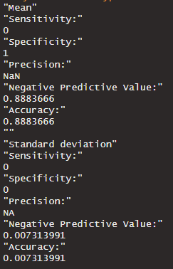

# TP7 parte A
*Lucas Moyano*

## Codigo

### create_folds()
```
create_folds <- function(dataframe, nFolds) {
  rows <- nrow(dataframe)
  
  elementsPerFold <- floor(rows/nFolds)
  
  foldList <- list()
  for (fold in 1:nFolds) {
    
      indexBegin <- (fold-1) * elementsPerFold + 1
    # This is divided so in the last fold all the remaining elements caused by the ceiling of the elementsPerFold are placed in the last fold
    if(fold != nFolds) {
      indexEnd <- (fold) * elementsPerFold
    } else {
      indexEnd <- rows
    }
      
      foldList[[paste("Fold", fold)]] <- c(indexBegin:indexEnd)
  }
  
  return(foldList)
}
```
### cross_validation()
```
cross_validation <- function(dataframe, nFolds) {
  foldIndexList <- create_folds(dataframe, nFolds)
  
  metricsList <- list()
  
  for (fold in 1:nFolds) {
    # Here we remove the validation fold
    ignoredIndexes <- foldIndexList[[fold]]
    
    trainFoldsDF <- dataframe[-ignoredIndexes,]
    validationFoldDF <- dataframe[ignoredIndexes,]
    # Here we calculate the prediction for the other folds
    train_formula <- formula(inclinacion_peligrosa~id+altura+circ_tronco_cm+diametro_tronco+long+lat+seccion+area_seccion)
    tree_model <- rpart(train_formula, data = trainFoldsDF, method = "class")
    predProbs <- predict(tree_model, validationFoldDF, type="class")

    validation_comparison <- data.frame(id=validationFoldDF$id, inclinacion_peligrosa = validationFoldDF$inclinacion_peligrosa, prediction_class = predProbs)

    cMatrix <- make_confusion_matrix(validation_comparison)
    metrics <- calculate_metrics(cMatrix)
    
    metricsList[[paste("Metric", fold)]] <- metrics
  }
  
  listMean <- calculate_list_mean(metricsList, nFolds)
  listSD <- calculate_list_sd(metricsList, nFolds)
  print("")
  print("Mean")
  print_metrics(listMean)
  print("")
  print("Standard deviation")
  print_metrics(listSD)
}
```

## Resultados

