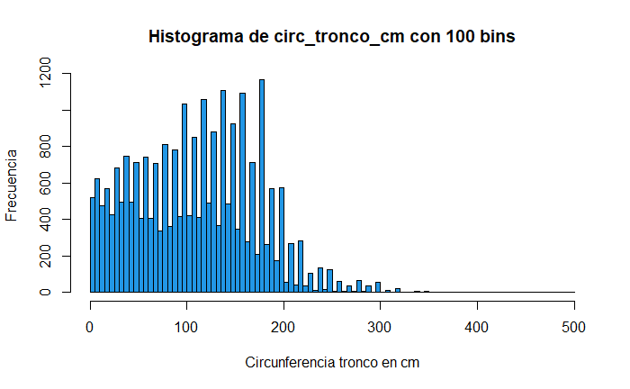

# TP7 parte A
*Lucas Moyano*

## Ejercicio 2
> A partir del archivo arbolado-mendoza-dataset-train.csv responder las siguientes preguntas:  
a. Cual es la distribución de las clase inclinacion_peligrosa?  
b. ¿Se puede considerar alguna sección más peligrosa que otra?  
c. ¿Se puede considerar alguna especie más peligrosa que otra? 

### a.

Como se puede notar en la imagen la distribución no es simétrica, los arboles que no tienen inclinación peligrosa son muchos más de los que si tienen.

### b.

Dividiendo el numero de arboles de una sección que tienen inclinación peligrosa con el numero de arboles de la sección en total, podemos ver cual es la sección con más cantidad de arboles con inclinación peligrosa respecto al numero de arboles totales de su sección en un porcentaje.

En este caso es el **Barrio Cívico** la sección que tiene más porcentaje de arboles con inclinación peligrosa, seguida por el **Parque O'Higgins**.

### c.

Dividiendo el numero de arboles de una especie que tienen inclinación peligrosa con el numero de arboles de las especie en total, podemos ver cual es la especie con más cantidades de arboles con inclinación peligrosa respecto al numero total de arboles de su especie en un porcentaje.

En este caso es el **Algarrobo** la especie que tiene más porcentaje de arboles con inclinación peligrosa por lejos.

## Ejercicio 3

> A partir del archivo arbolado-mendoza-dataset-train.csv:  
b.  Generar un histograma de frecuencia para la variable circ_tronco_cm. Probar con diferentes números de bins.  
c.  Repetir el punto b) pero separando por la clase de la variable inclinación_peligrosa?  
d.  Crear una nueva variable categórica de nombre circ_tronco_cm_cat a partir circ_tronco_cm, en donde puedan asignarse solo 4 posibles valores [ muy alto, alto, medio, bajo ]. Utilizar la información del punto b. para seleccionar los puntos de corte para cada categoría. Guardar el nuevo dataframe bajo el nombre de arbolado-mendoza-dataset-circ_tronco_cm-train.csv

### b.

### c.

### d.

Los criterios de corte son:  
- Si es menor que 90, bajo  
- Si es mayor o igual que 90 y menor que 170, medio  
- Si es mayor o igual que 170 y menor que 240, alto  
- Si es mayor o igual que 240, muy alto  