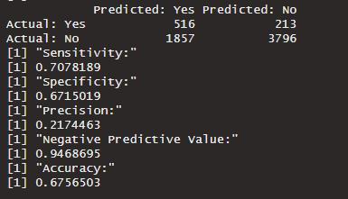
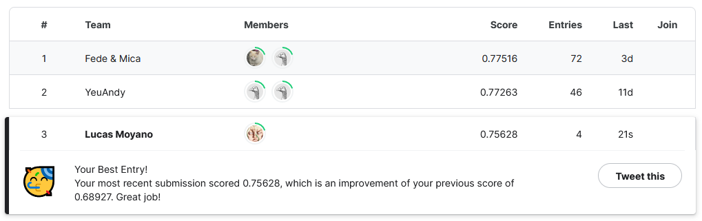

# TP7 parte B
*Lucas Moyano*

## Descripción

- Utilicé todas las variables.
- Hice undersampling.
- No convertí las predicciones a 0 y 1.

## Resultados obtenidos sobre el conjunto de validación



## Resultados obtenidos en Kaggle



## Descripción detallada del algoritmo propuesto

Utilicé el algoritmo de randomforest de la librería de ranger.

```
# Undersampling

cantArbolesPeligrosos <- data_train %>% filter(inclinacion_peligrosa == 1) %>% nrow()
cantArbolesNoPeligrosos <- data_train %>% filter(inclinacion_peligrosa == 0) %>% nrow()
cantArbolesPeligrosos

arbolesPeligrososDS <- data_train %>% filter(inclinacion_peligrosa == 1)
arbolesNoPeligrososDS <- data_train %>% filter(inclinacion_peligrosa == 0)

arbolesNoPeligrososUndersampledDS <- arbolesNoPeligrososDS %>% sample_n(cantArbolesPeligrosos)

underSampledTrainData <- rbind(arbolesPeligrososDS, arbolesNoPeligrososUndersampledDS)

rows1 <- nrow(underSampledTrainData)
rows1
```

Acá realizo un **undersampling** para los arboles que no tienen inclinación peligrosa para balancearlos con la cantidad de arboles que si tienen inclinación peligrosa, ya que estos últimos representan una cantidad mucho menor en el dataset que los arboles sin inclinación peligrosa.  
**El undersampling es logrado principalmente con las funciones filter y sample_n** de dplyr.

```
# Training model
train_formula <- formula(inclinacion_peligrosa~id+especie+ultima_modificacion+altura+circ_tronco_cm+diametro_tronco+long+lat+seccion+nombre_seccion+area_seccion)
```

Acá se toman todas las variables para la formula que vamos a darle al random forest.

```
rf_model <- ranger(train_formula, data = underSampledTrainData)
```
Usamos el algoritmo random forest de la libreria ranger.
```
# Using model on validation
preds_tree_probs = predict(rf_model, data_validation)

preds_tree = ifelse(preds_tree_probs$predictions >=0.5,1,0)

validation_comparison <- data.frame(id=data_validation$id, inclinacion_peligrosa = data_validation$inclinacion_peligrosa,prediction_class=preds_tree)

cMatrix <- make_confusion_matrix(validation_comparison)
cMatrix
metrics <- calculate_metrics(cMatrix)
print_metrics(metrics)
```
Hacemos las predicciones para el dataset de validation y calculamos la matriz de confusion y sus métricas usando las funciones implementadas para la parte A del Trabajo Practico sobre el dataset de validación. Acá en la predicción si normalizamos por como funcionan las funciones.
```
# Using model on test
test_preds_tree_probs = predict(rf_model, data_test)

#test_preds_tree = ifelse(test_preds_tree_probs$predictions >=0.5,1,0)
test_preds_tree = test_preds_tree_probs$predictions

submission <- data.frame(id=data_test$id, inclinacion_peligrosa = test_preds_tree)
write_csv(submission,"../data/arbolado-mza-dataset-envio-rf2-undersampled.csv")
submission
```
Hacemos nuestra predicción para el dataset de test usando el modelo de random forest mencionado anteriormente. Esta vez sin normalizar.