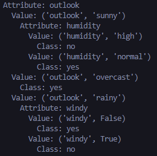
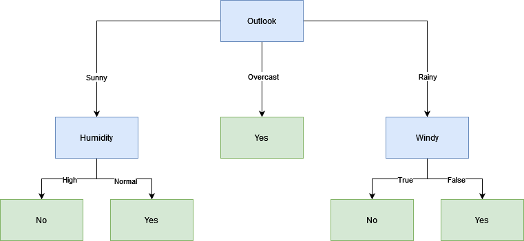

# TP7 parte C
*Lucas Moyano*

## A

  
*Salida de consola*

  
*Arbol graficado*

## B

Para datos de tipo real, emplean estrategias como la ganancia de información o el índice Gini para dividir los datos. Manejan variables numéricas mediante particiones binarias o transformaciones, y las categóricas con técnicas como one-hot encoding. Para prevenir el sobreajuste, se utilizan métodos como la poda del árbol o limitar la profundidad. Además, pueden abordar desafíos como datos desbalanceados asignando pesos de clase. Los ensambles, como Random Forest, combinan múltiples árboles para mejorar la generalización.